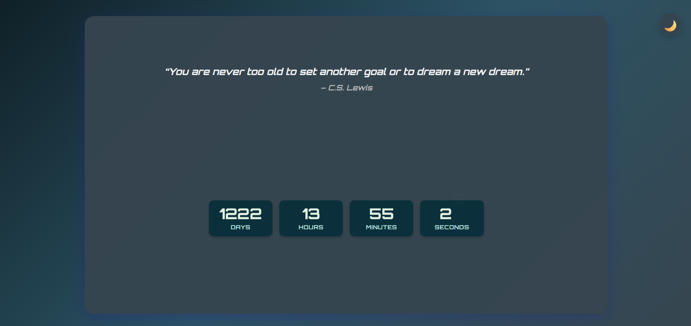

# Countdown

A stylish, animated countdown timer featuring dynamic digit animations, automatic inspirational quotes, theme toggling (dark/light), offline PWA support, and a highly responsive design.

## Features

- **Animated digits:** Only the changing digits animate out and in.
- **Automatic Quotes:** Displays inspirational quotes that update automatically at a set interval.
- **Heartbeat effect:** Time boxes pulse when their value changes.
- **Dark/Light mode:** Auto-detects system preference, with manual toggle.
- **Audible alerts:** Plays distinct sounds for day, hour, minute, and second changes (volume adjustable).
- **Responsive:** Looks great on all devices and adapts layout to screen shape.
- **Theme presets:** Easily extendable for more color themes.
- **Accessible:** ARIA attributes and keyboard navigation support.
- **Offline support:** Works offline as a Progressive Web App (PWA).

## Usage

1. Clone or download this repository.
2. Serve the folder with a local server (recommended for offline/PWA features).
   - Example: `npx serve .` or use the Live Server extension in VS Code.
3. Open `index.html` in your browser.

## Customization

- Change the target date in `script.js`:
  ```js
  const targetDate = new Date("2028-09-29T00:00:00+05:30");
  ```

## License

MIT

## Preview


