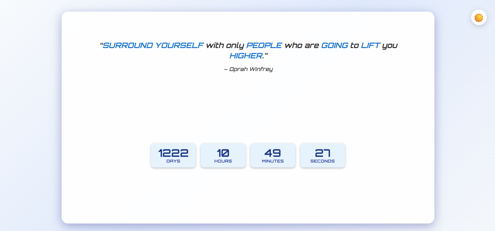

# ⏳ TickTock, Quote O’Clock

A stylish, animated countdown timer with inspirational quotes, dynamic visuals, and full offline support. Built with responsiveness, customization, and motivation in mind.

---

## 🌟 Features

- **🎞️ Animated Digits:** Only the digits that change animate, for smooth, subtle transitions.
- **💬 Animated Quotes:** Inspirational quotes appear with a letter-shuffling animation.
- **🔍 Keyword Highlighting:** Automatically bolds key words in quotes to draw attention.
- **❤️ Heartbeat Effect:** Time blocks pulse when their value changes — a subtle nod to urgency.
- **🌓 Dark/Light Mode:** Auto-detects system preference with manual override.
- **🔔 Audible Alerts:** Unique sounds for each unit change (day, hour, minute, second) with adjustable volume.
- **📱 Responsive Design:** Works beautifully on all screen sizes and orientations.
- **🎨 Theme Presets:** Easily extend or customize color themes.
- **♿ Accessibility-Friendly:** Includes ARIA tags and full keyboard navigation support.
- **🌐 Offline Ready:** Full PWA support — works offline and installable on desktop/mobile.

---

## 🚀 Usage

1. Clone or download this repository.
2. Serve the project locally:
   ```bash
   npx serve .
   ```
   Or use **Live Server** in VS Code.
3. Open `index.html` in your browser.

> **Note:** For full offline support and PWA functionality, serving via a local server is required.

---

## ⚙️ Customization

### 🎯 Changing the Countdown Target

Open `js/config.js` and update the target date:

```js
export const TARGET_DATE = new Date("2028-09-29T00:00:00+05:30");
```

---

## 💬 Managing Quotes

Inspirational quotes are stored in `quotes.json`. You can add, clean, and organize them using the built-in Python script.

### ➕ Adding New Quotes

Edit `quotes.json` manually using this format:

```json
{
  "q": "Your inspiring quote goes here.",
  "a": "Author's Name"
}
```

> If the author is unknown, use `"a": "Unknown"` — the script will normalize it to `"Anonymous"`.

---

### 🧹 Cleaning and Fixing Quotes

The included `quote.py` script performs the following:

- ✅ **Deduplication by Similarity:** Removes quotes that are _almost identical_ (90% similarity threshold).
- ✍️ **Author Correction:** Replaces `"Anonymous"` with a specific author if found in a duplicate.
- ♻️ **"Unknown" Normalization:** Converts `"Unknown"` to `"Anonymous"`.
- 📁 **Archiving Removed Quotes:** Stores removed quotes in `removed_quotes.json` along with their matched counterparts.
- 🔀 **Optional Shuffling:** Enable shuffling by setting `flag=True` in the script.

#### ▶️ How to Run the Script

1. Ensure Python 3 is installed.
2. Place `quote.py` in the same directory as `quotes.json`.
3. Run the script:
   ```bash
   python quote.py
   ```

The script will output:

- Original quote count
- Cleaned quote count
- Removed quote count

---

### 🤖 Error Handling Fallback

If quotes cannot be loaded, a fallback quote is shown:

```js
  {
    "q": "Oops! The quotes went on vacation without telling us.",
    "a": "The Missing Quote Squad"
  }
```

---

# 📝 Changelog

See [CHANGELOG.md](CHANGELOG.md) for the full list of changes and release history.

---

## 🖼️ Preview

- Light Theme  
  
- Dark Theme  
  

---

## 📄 License

MIT License
